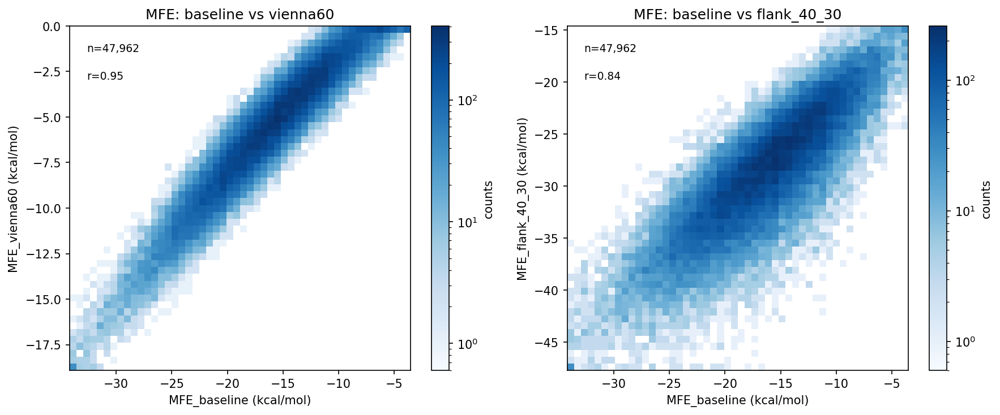
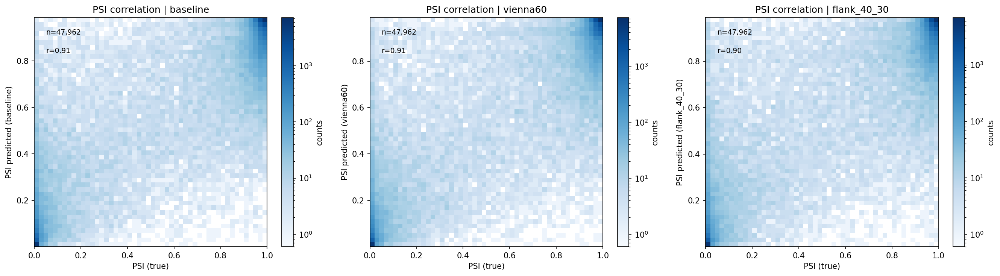
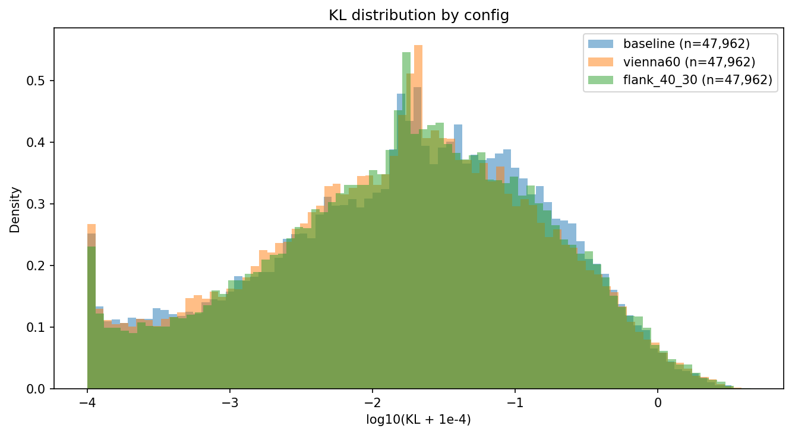
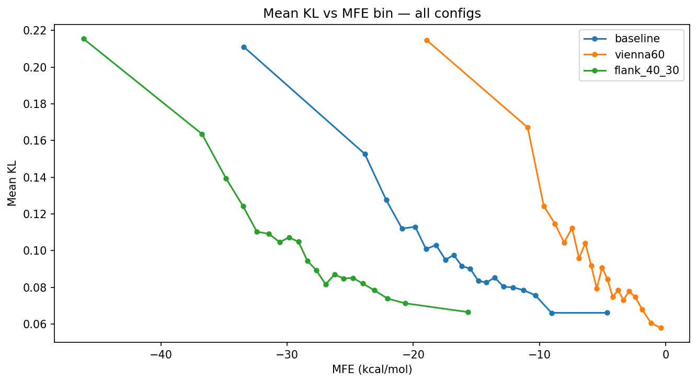

# Cross-config comparison

**Configs compared:** baseline, vienna60, flank_40_30

## KL summary

| config      |     n |   mean_kl |   median_kl |   p90_kl |   p95_kl |
|:------------|------:|----------:|------------:|---------:|---------:|
| baseline    | 47962 | 0.0999042 |   0.020299  | 0.268215 | 0.467327 |
| vienna60    | 47962 | 0.0975058 |   0.0181681 | 0.258483 | 0.471613 |
| flank_40_30 | 47962 | 0.103971  |   0.0190171 | 0.277817 | 0.496447 |

## Plots

